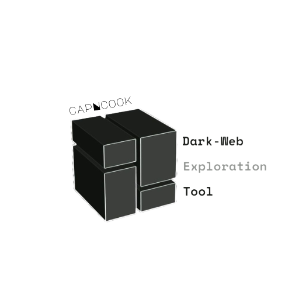
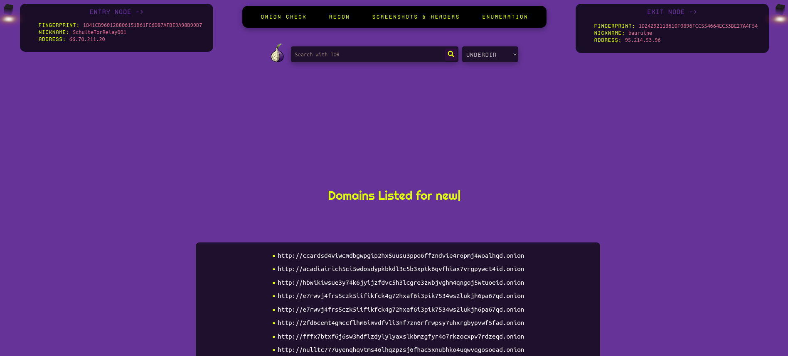
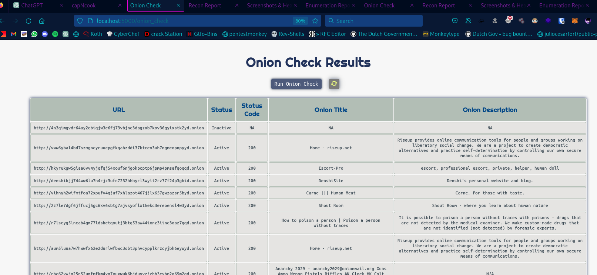
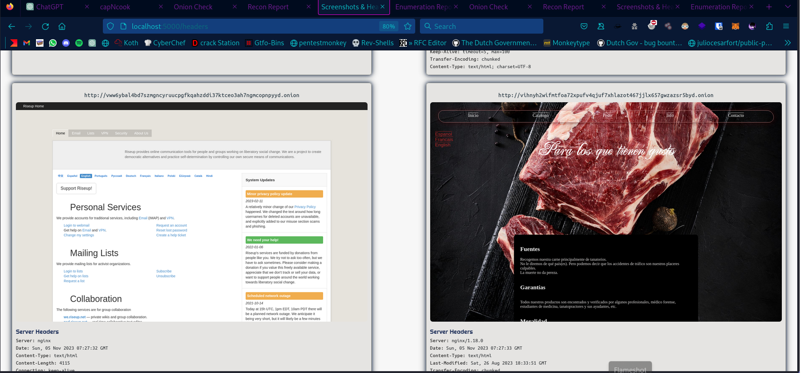
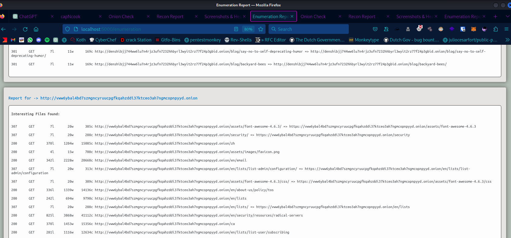

➡️
<a href="https://github.com/hoodietramp/wiki">Documentation</a> |
    <a href="https://hackersarcade.com">Discord</a> |
        <a href="https://github.com/hoodietramp/capNcook/wiki/Installation">Installation Guide</a>  
 ⬅️
<!-- 
 
   -->

  
    

 

**Disclaimer:** This tool is intended for educational and research purposes only. Unauthorized use of this tool is prohibited. Use it responsibly and at your own risk.

# 🤔 What is this?

capNcook is a Python Flask-based web application designed for dark web exploration. 

> "What about anonymity?"

That's the point. You don't need to worry about it now, our tool utilizes tor for anonymity and privacy, identifies entry and exit nodes while esthablishing a tor circuit, 
rebuild the tor circuit each time you run the tool and flush old circuits. 

The tool employs efficient multi-threading in Python to enhance performance 🚀 

Live implementation of different tools and techniques to explore and do basic recon on hidden services over TOR

## 📊 capNcook : First of its kind

| **Name**                                   | ⚡ capNcook ⚡ |
| ------------------------------------------ | -------------|
| Unifies results from multi Dark-Web Search Engines | ✅           |
| Identify Entry/Exit Nodes In Tor Circuit   | ✅           |
| Multiple functionalities                   | ✅           |
| Supports Multithreading                    | ✅           |
| Easy to set up                             | ✅           |
| Can run as tor hidden service              | ✅           |
| Created for hackers by hackers             | ✅           |

# ✨ Features

- **Search Over Tor:** Utilize different search engines on the dark web to find relevant onion domains.

- **Anonymity and Privacy:** Identify entry and exit nodes to ensure anonymity and privacy when interacting with onion domains. The tool includes circuit rebuilding to maintain security.

- **TOR Whois Information:** Retrieve WHOIS information for onion domains.

- **Screenshots:** Capture screenshots and grab response headers of .onion sites.

- **Subdirectories:** Identify and list subdirectories of onion web-servers.

## Requirements

- Python 3 [`sudo apt install python3`]
- Python3-pip [`sudo apt install python3-pip`]
- Flask
- Stem
- Requests
- BeautifulSoup
- Termcolor
- Dotenv
- AquaTone (for screenshot functionality)
- FeroxBuster (for enumeration functionality)
- Tor [`sudo apt install tor`]
- WhoIS [`sudo apt install whois`]
- Proxychains [`sudo apt install proxychains4`]
- Jq - process json data
- Chromium [`sudo apt install chromium`]

# 🎬 Getting Started

If you're having trouble with setting up capNcook, [read this.](https://github.com/hoodietramp/capNcook/wiki/Common-Issues-&-Their-Solutions)

## ‼️ Important Links (Docs, Installation guide, Discord Support)

| Installation Guide                                                          | Documentation                                             | Discord                                     |
| --------------------------------------------------------------------------- | --------------------------------------------------------- | ------------------------------------------- |
| 📖 [Installation Guide](https://github.com/hoodietramp/capNcook/wiki/Installation) | 📚 [Documentation](https://github.com/hoodietramp/capNcook/wiki) | 🦜 [Discord](https://discord.gg/QhHe7nNRSU) |

## 🏃‍♀️Running capNcook

You can run capNcook -

1. Run with flask `flask run`
2. Normal way with python3 `python3 app.py`

# 🔭 Usage Guidelines

| Name | ⚡ What does it do? ⚡|
|--------------------|------------------------------------------------------------------------------------------|
|🔍 **Search Page** | Enter keyword, Select search engine, index onion domains.|
|🧅 **Onion Check** | Click on `Run Onion Check` button to check the status of onion domains, including response codes, titles, and descriptions.|
|🕵️ **Recon** | Click on `Run Recon` button to perform WHOIS lookups on onion domains.|
|🗡 **Headers** | Click on `Run Headers` button to capture response headers and screenshots of onion domains.|
|🪐 **Enumeration** | Click on `Run Dir Fuzz` button to run FeroxBuster against onion domains to find sub-directories/files.|

# Screenshots

- This is the main interface of tool, select your preferred search engine and you can search using keywords like you'd do over any normal search engine and it'll list domains related to the keyword.

- In `onion_check`, it'll grab the site's title and description, its status code, and based on the status code it'll filter it as active / inactive.

- In recon, it's doing recon using `torwhois` database to pull info regarding each listed onion domain if available.

- In headers, it's taking screenshots and grabbing server response headers, often reveals the technology or programming language used to build the web application via header like `X-Powered-By`, It may include information about the underlying frameworks or CMS (Content Management System) being used. The `Server` header typically indicates the software and version running on the server.

- In enumeration, it's doing basic directory fuzzing for each onion domain using the wordlist.txt

## ⚗️ Contributions and Issues

Don't be afraid to contribute! We have many, many things you can do to help out. If you're trying to contribute but stuck, tag @hoodietramp, join our [discord](https://discord.gg/QhHe7nNRSU) server ✨

Contributions are welcome, but ensure they align with ethical use. If you encounter issues, please report them on the [GitHub repository](https://github.com/hoodietramp/capNcook/issues).

By doing so, you'll get your name added to the README below and get to be a part of an ever-growing project

## 💰 Financial Contributors

The contributions will be used to fund not only the future of capNcook and its authors, but also Cyber Security Club at the PIET College, Panipat, India.

## ✨ Contributors

Thanks goes to these wonderful people ([emoji key](https://allcontributors.org/docs/en/emoji-key)):

<!-- ALL-CONTRIBUTORS-LIST:START - Do not remove or modify this section -->
<!-- prettier-ignore-start -->
<!-- markdownlint-disable -->
<table>
  <tr>
    <td align="center"><a href="https://github.com/holmes-py"> <b>Mr. Holmes</b></a> <a href="#design-holmes-py" title="Design">🎨</a> <a href="#maintenance-holmes-py" title="Maintenance">🚧</a> <a href="#mentoring-holmes-py" title="Mentoring">🧑‍🏫</a> <a href="https://github.com/hoodietramp/capNcook/commits?author=holmes-py" title="Code">💻</a> <a href="#ideas-holmes-py" title="Ideas, Planning, & Feedback">🤔</a></td>
    <td align="center"><a href="https://github.com/0dayCTF"> <b>0day</b></a> <a href="#mentoring-0dayCTF" title="Mentoring">🧑‍🏫</a> <a href="#promotion-0dayCTF" title="Promotion">📣</a> <a href="#ideas-0dayCTF" title="Ideas, Planning, & Feedback">🤔</a></td>
  </tr>
</table>

<!-- markdownlint-restore -->
<!-- prettier-ignore-end -->

<!-- ALL-CONTRIBUTORS-LIST:END -->

This project follows the [all-contributors](https://github.com/all-contributors/all-contributors) specification. Contributions of any kind welcome!

## Disclaimer

This tool is provided for educational purposes only. The developers are not responsible for any misuse or illegal activities conducted with this tool. Use it responsibly and ethically 🙏
