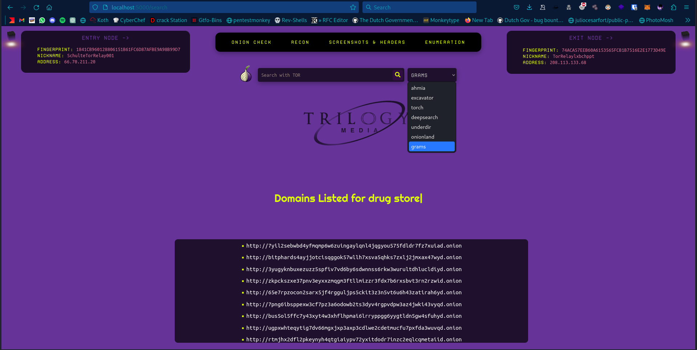
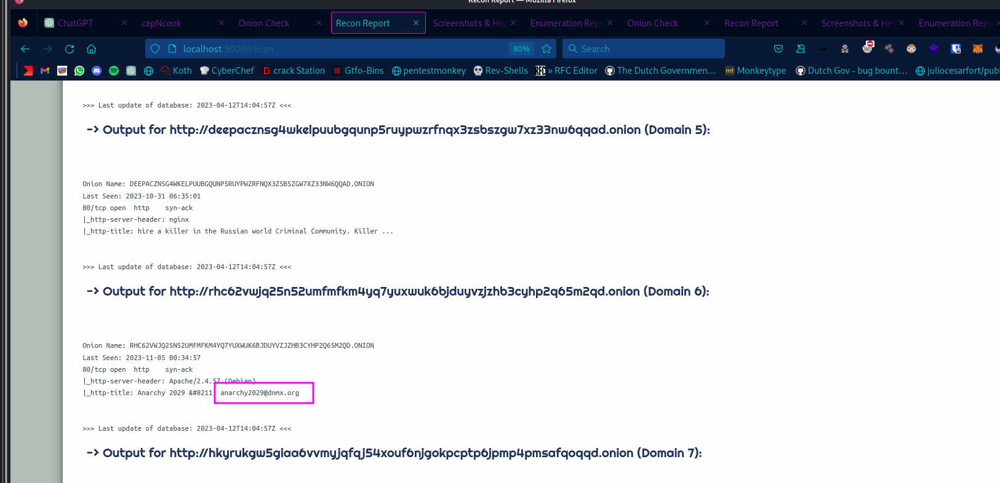

# capNcook :shipit:

**Disclaimer:** This tool is intended for educational and research purposes only. Unauthorized use of this tool is prohibited. Use it responsibly and at your own risk.

## Overview

capNcook is a Python Flask-based web application designed for dark web exploration. It utilizes Tor for anonymity and privacy, offering various features such as searching, retrieving response codes, TOR whois information, response headers, screenshots, and subdirectories of onion web-servers.

The tool employs efficient multi-threading in Python to enhance performance 🚀 

## Features

1. **Search Over Tor:** Utilize different search engines on the dark web to find relevant onion domains.

2. **Anonymity and Privacy:** Identify entry and exit nodes to ensure anonymity and privacy when interacting with onion domains. The tool includes circuit rebuilding to maintain security.

3. **TOR Whois Information:** Retrieve WHOIS information for onion domains.

4. **Response Headers:** Capture response headers of onion domains.

5. **Screenshots:** Capture screenshots of onion websites.

6. **Subdirectories:** Identify and list subdirectories of onion web-servers.

## Requirements

- Python 3 [`sudo apt install python3`]
- Python3-pip [`sudo apt install python3-pip`]
- Flask
- Stem
- Requests
- BeautifulSoup
- Termcolor
- Dotenv
- AquaTone (for screenshot functionality)
- FeroxBuster (for enumeration functionality)
- Tor [`sudo apt install tor`]
- WhoIS [`sudo apt install whois`]
- Proxychains [`sudo apt install proxychains4`]
- Jq - process json data
- Chromium [`sudo apt install chromium`]

## Setup and Usage

1. Install necessities:

    ```bash
    sudo apt update && sudo apt upgrade -y ; sudo apt install python3 python3-pip tor chromium jq whois proxychains4 unzip
    ```

2. Install the required dependencies using:

    ```bash
    pip3 install -r requirements.txt
    ```

3. Install AquaTone for screenshots:

    ```bash
    wget https://github.com/michenriksen/aquatone/releases/download/v1.7.0/aquatone_linux_amd64_1.7.0.zip
    unzip aquatone_linux_amd64_1.7.0.zip
    mv aquatone /usr/bin/
    chmod +x /usr/bin/aquatone
    rm LICENSE.txt README.md aquatone_linux_amd64_1.7.0.zip
    ```

    OR


    ```bash
    cp ./aquatone /usr/bin/
    ```

4. Install FeroxBuster for enumeration:

    ```bash
    wget https://github.com/epi052/feroxbuster/releases/download/v2.10.0/x86_64-linux-feroxbuster.zip
    unzip x86_64-linux-feroxbuster.zip
    mv feroxbuster /usr/bin/
    chmod +x /usr/bin/feroxbuster
    rm x86_64-linux-feroxbuster.zip
    ```
5. Start Tor service:

    ```bash
    sudo systemctl start tor
    ```

5. Run the application:

    ```bash
    flask run
    ```
    
    OR

    ```bash
    python3 app.py
    ```

6. Access the tool in your web browser at `http://localhost:5000/`.

## Screenshots

- This is the main interface of tool, select your preferred search engine and you can search using keywords like you'd do over any normal search engine and it'll list domains related to the keyword.



- In `onion_check`, it'll grab the site's title and description, its status code, and based on the status code it'll filter it as active / inactive.


- In recon, it's doing recon using `torwhois` database to pull info regarding each listed onion domain if available.



- In headers, it's taking screenshots and grabbing server response headers, often reveals the technology or programming language used to build the web application via header like `X-Powered-By`, It may include information about the underlying frameworks or CMS (Content Management System) being used. The `Server` header typically indicates the software and version running on the server.


- In enumeration, it's doing basic directory fuzzing for each onion domain using the wordlist.txt


## Usage Guidelines

- **Search Page:** Enter keywords and select a search engine to find onion domains.

- **Onion Check:** Check the status of onion domains, including response codes, titles, and descriptions.

- **Reconnaissance:** Perform WHOIS lookups on onion domains.

- **Headers:** Capture response headers and screenshots of onion domains.

- **Enumeration:** Use FeroxBuster to find hidden paths on onion domains.

## Contributions and Issues

Contributions are welcome, but ensure they align with ethical use. If you encounter issues, please report them on the [GitHub repository](https://github.com/hoodietramp/capNcook).

## Disclaimer

This tool is provided for educational purposes only. The developers are not responsible for any misuse or illegal activities conducted with this tool. Use it responsibly and ethically 🙏